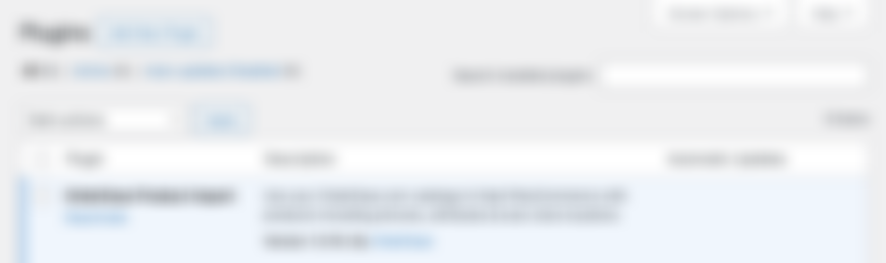
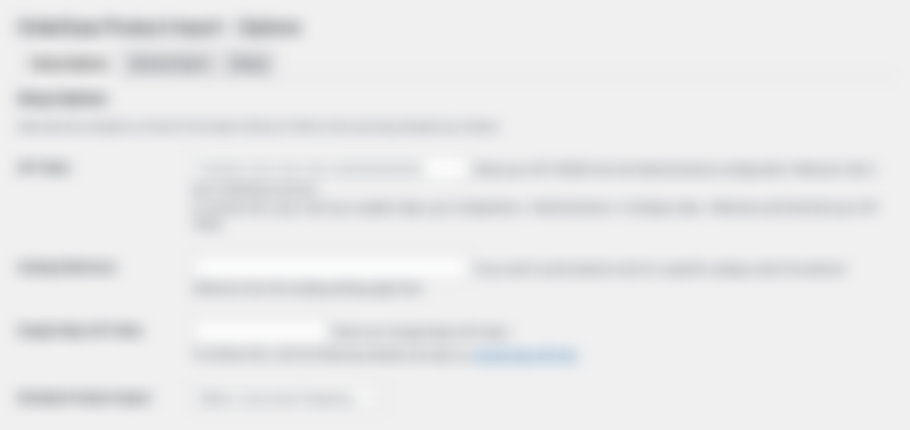
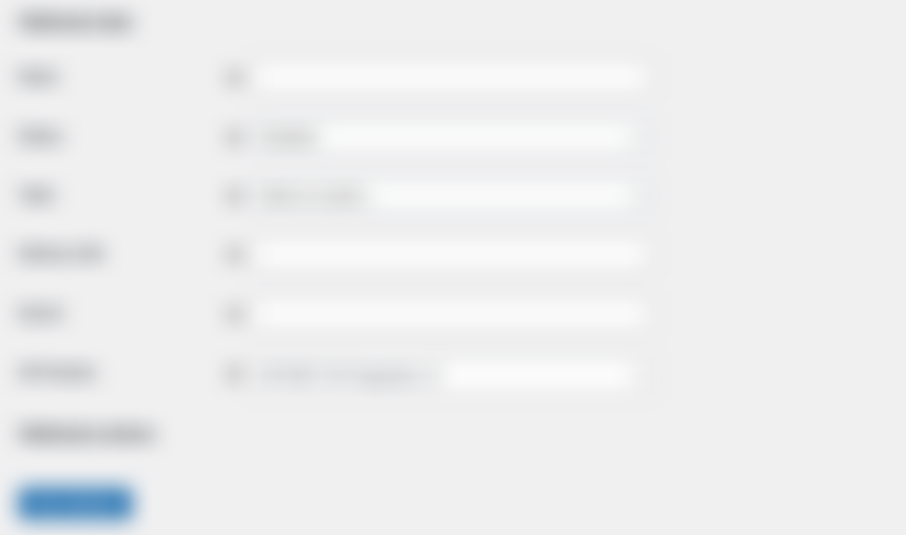

Setup your \[Company 1\] integration
====================================================

### With a plugin and a few customizations, your \[Company 1\] site will be ready to show off your wholesale catalog, all while protecting pricing behind a customer login. This guide will help you get started with your \[Company 1\] integration.

*   [Getting Started](#getting-started)
*   [Generate your API key](#generate-your-api-key)
*   [Activate your integration](#activate-your-integration)
*   [Install the \[Company 2\]/\[Company 1\] plugin](#install-the-company-2company-1-plugin)
*   [Setup the \[Company 2\]/\[Company 1\] Webhook](#setup-the-company-2company-1-webhook)

Getting Started
---------------

1.  On the integrations page, scroll to the \[Company 1\] integration:
    

    

2.  Click the **Connect** button. You will see the following screen:
    

    

Generate your API key
---------------------

{: .warning }
Your API key is unique to your \[Company 2\] account and should never be shared with anyone you don’t trust with your customer data.

In order to properly integrate with \[Company 2\], you need to provide \[Company 1\] with an \[Company 2\] API key. This lets \[Company 1\] access your \[Company 2\] account and sync customer data across both platforms.

### To generate your unique API key:

1.  On the **Welcome** tab, click on **Generate API Key**.
    
2.  The blank field will populate with your unique key:
    

    

3.  Click the eye icon to reveal your API key. You will need the API key later when you [install the \[Company 2\]/\[Company 1\] plugin](#install-the-company-2company-1-plugin) in \[Company 1\].
    
4.  Done!

Activate your integration
-------------------------

When you’re ready to activate your \[Company 2\]/\[Company 1\] integration, click the **Activate** tab:

### To activate your \[Company 2\]/\[Company 1\] integration:

1.  If you want to bring existing \[Company 1\] orders into \[Company 2\], check the **Pull Orders** **from \[Company 1\]** box.
    
2.  Click **Activate My Account**. Then, click the **Save** tab in the upper-right corner.
    
3.  Done! Your integration is now active:
    

    

In the main integrations menu, the **Connect** button will be replaced by the green **Connected** banner.

{: .note }
To use your integration, you need to [install the \[Company 2\] plugin](#install-the-company-2company-1-plugin) in \[Company 1\]. To learn how to install the plugin, see the steps below.

Install the \[Company 2\]/\[Company 1\] plugin
----------------------------------------------

To start using your integration, you need to download the \[Company 2\]/\[Company 1\] plugin, then install it in \[Company 1\].

### To download the plugin:

1.  Click the **Install / Download** tab. You will see only one option:
    

    

2.  Click **Download**. The plugin will begin downloading as a `.zip` file.
    
{: .warning }
IMPORTANT: Do not unzip the file or try to access its contents on your computer. It is only compatible with \[Company 1\].

3.  Once the plugin has been downloaded, login to your \[Company 1\] account. On the left sidebar, navigate to **Plugins**:
    

    

4.  From the Plugins page, click **Add New Plugin**, then **Upload Plugin**:
    

    

5.  Click **Choose File** and select the `.zip` file supplied by \[Company 2\]:
    

    

6.  Click **Install Now**, then **Activate**. The \[Company 2\] plugin will now be visible on the main plugins page:
    

    

7.  Done! See the steps below to configure your plugin with the correct credentials.
    

### To configure the plugin:

1.  In the left sidebar on \[Company 1\], hover over **Tools**, then click **\[Company 2\] Product Import Admin**:
    

    

2.  You will be brought to the import options menu. There are [various settings here depending on your import preferences](). For the initial setup, paste [your unique API key](#generate-your-api-key) into the **API Token** field:
    

    

3.  Click **Schedule Product Import** to choose the frequency of your scheduled product imports:
    

    

4.  Click **Save Changes** at the bottom of the screen. Then, click the **Debug** tab at the top of the screen:
    

    

5.  Ensure that **Development Mode** is enabled, while **Use Staging API** is disabled. Then, click **Save Changes** at the bottom of the screen.
    
6.  Done!

Setup the \[Company 2\]/\[Company 1\] Webhook
---------------------------------------------

The \[Company 2\]/\[Company 1\] Webhook allows your integration to handle new orders.

### To setup the Webhook in \[Company 2\]:

1.  From the \[Company 1\] integration page, click the **Settings** tab, then navigate to **Order Settings**:
    

    

2.  Click the **Pull Orders on Status** drop-down menu. You will see the following options:
    

    

{: .note }
New orders in \[Company 1\] will only be pulled into \[Company 2\] once they reach the status you specify here. We recommend choosing the **Processing** status.

3.  Select your preferred status. Done!
    

### To setup the Webhook in \[Company 1\]:

1.  Login to your \[Company 1\] account. In the left sidebar, hover over **\[Company 1\]**, then click **Settings**:
    

    

2.  Click the **Advanced** tab, then click **Webhooks**:
    

    

3.  Click **Add webhook**. You will see the following fields:
    

    

4.  Fill the fields with the following information:
    
| **Field**       | Value                                                                                                  |
|-----------------|--------------------------------------------------------------------------------------------------------|
| **Name**        | Order Updated                                                                                          |
| **Status**      | Active                                                                                                 |
| **Topic**       | Order Updated                                                                                          |
| **DeliveryURL** | [https://\[Company 2\].com/api/plugins/\[Company 1\]/Order/v2/Hook/](){**api\_key**}* |
| **Secret**      | (This field will auto-populate once you’ve entered the Delivery URL)                                   |

{: .note }
*Replace **api\_key** with [your own \[Company 2\]/\[Company 1\] API key.](#to-generate-your-unique-api-key)

5.  Click **Save Webhook**. Done!
    
* * *

{: .info }
For a detailed guide on how to configure your integration behaviour, see [Manage your products in \[Company 2\]/\[Company 1\]]().