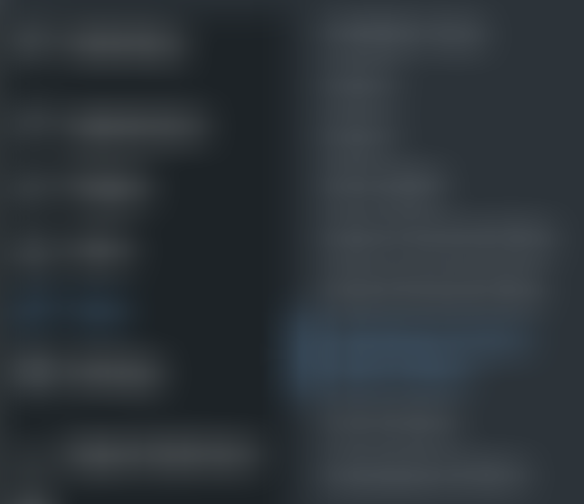

Manage your Products in \[Company 2\]/\[Company 1\]
===================================================================

### You have many options to manage how product data is transferred between \[Company 2\] and \[Company 1\]. This guide will help you configure the behaviour of your integration.

{: .info }
This guide assumes you’ve already [activated your \[Company 1\] integration]() and [installed the \[Company 2\] plugin]() for \[Company 1\].

*   [Understand how product data is mapped](#understand-how-product-data-is-mapped)
*   [Choose a fulfillment source](#choose-a-fulfillment-source)
*   [Assign pricing](#assign-pricing)
*   [Sync product data](#sync-product-data)
*   [Remove a product in \[Company 1\]](#remove-a-product-in-company-1)

Understand how product data is mapped
-------------------------------------

{: .note }
Before you start syncing products between \[Company 2\] and \[Company 1\], it’s a good idea to take a look at how product data is mapped between both platforms.

| **[Company 1]**          | **[Company 2]**                 |
|--------------------------|---------------------------------|
| Product Name             | Title                           |
| Product Code (SKU)       | SKU                             |
| UPC                      | Barcode (ISBN, UPC, GTIN, etc.) |
| Product Long Description | Description                     |
| Category                 | Product Type & Tags (Category:) |
| Vendor                   | Tags (Vendor:)                  |
| Fulfillment Source       | Tags (Fulfillment Source:)      |
| Active/Inactive          | Active/Inactive                 |
| Online Retail Price      | Price                           |

Choose a fulfillment source
---------------------------

Once you’ve reviewed how product data is mapped between \[Company 2\] and \[Company 1\], you can start the import process:

1.  Navigate to the **Products** tab in \[Company 2\].
    
2.  Click the **Sales Channels** filter, then click **Not Available Online.** This will show you products that aren’t on \[Company 1\] yet:
    

3.  Click **Details** for any product to open the **Product Details** menu. Then, click the **Sales Channels** tab:
    

4.  Under **Retail Online Channels**, click **Show on \[Company 1\]**. You will see a **\+** icon appear:
    

Click **\+** to select one or more fulfillment sources for this product:

|                              | **Fulfilled by Supplier**             | **Fulfilled by you**            |
|------------------------------|---------------------------------------|---------------------------------|
| **Dropship**                 | ✓ Supplier ships directly to customer |                                 |
| **Via Supplier’s Inventory** | ✓ Supplier ships to you               | ✓ You ship to customer          |
| **Via My Inventory**         |                                       | ✓ You ship directly to customer |
    

{: .note }
You can only select **My Inventory** if you have purchased the product and have it in stock.

Assign pricing
--------------

### To adjust pricing for one product:

Once you’ve selected your fulfillment sources, you will have the option to adjust pricing for the product depending on the source.

### To adjust pricing in bulk:

1.  From the **Products** tab, select each product you want to update by clicking the checkbox beside it:
    

2.  Click **Bulk Actions** in the upper-left corner. Then, click **General Bulk Editor**, and **Apply**. The bulk editor will open for the products you’ve selected:
    

3.  Under **Sales Channels**, click **Online Retail Price**:
    

{: .note }
If you would like to set discounts for products, you can also select **Online Retail Sale Price**.

4.  Click **Apply.** You will then have the option to set prices for your products. Done!
    

Sync product data
-----------------

Once you’ve assigned pricing and fulfillment sources to your products in \[Company 2\], you’re ready to sync product data from \[Company 2\] to \[Company 1\].

### To run a manual import:

1.  Login to your \[Company 1\] account. In the left sidebar, hover over **Tools**, then click **\[Company 2\] Product Import Admin**:
    

2.  Click the **Manual Import** tab, then click **Run manual import**:
    

3.  Done! Your products will be pulled from \[Company 2\] into \[Company 1\].
    

### To schedule an import:

1.  Login to your \[Company 1\] account. In the left sidebar, hover over **Tools**, then click **\[Company 2\] Product Import Admin**:
    

2.  In the **Setup Options** tab, click **Schedule Product Import**. Choose the frequency of your scheduled product imports:
    

3.  Click **Save Changes** at the bottom of the page. Done!

Remove a product in \[Company 1\]
---------------------------------

You can easily remove a product from \[Company 1\]:

1.  Navigate to the **Products** tab in \[Company 2\]:
    

2.  Click **Details** for any product to open the **Product Details** menu. Click the **Sales Channels** tab, then scroll to **Retail Online Channels**:
    

3.  Under **Show on \[Company 1\]**, you will see any fulfillment sources assigned to this product. Click the red garbage bin on these fulfillm